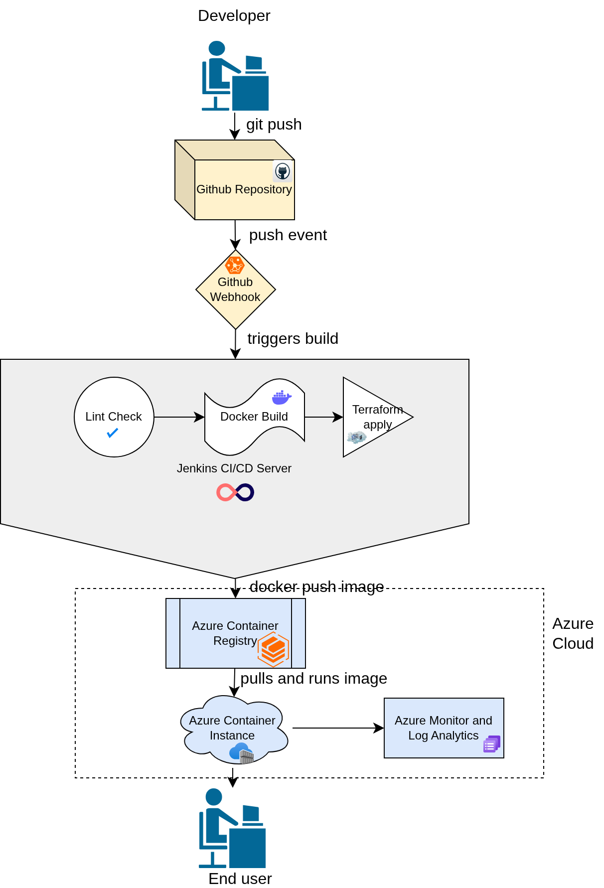

## Overview

This project is a production-ready deployment of the MoonShill landing page, a React
and Vite web application. The original application was forked from
https://github.com/timileyindev/moonshill-landing and served as the base for this
challenge.

The goal was to take that existing application and build everything around it that a
real production environment would need infrastructure provisioning, containerisation,
an automated CI/CD pipeline, cloud deployment, and monitoring without any manual
steps involved in the deployment process.

The entire setup was completed on Azure instead of AWS because that was the available
cloud provider. Every AWS service mentioned in the challenge brief has a direct Azure
equivalent and those mappings are explained clearly in the Design Decisions section.

---

## Architecture Overview

The system is made up of several components that work together from the moment code
is pushed to GitHub all the way to the application being live and accessible on the
internet.

A developer pushes code to the main branch on GitHub. GitHub detects the push and
sends a notification to Jenkins through a configured webhook. Jenkins picks up the
notification, pulls the latest code, and starts running the pipeline automatically.

The pipeline first installs the application dependencies, then runs a lint check to
catch any code quality issues before anything gets built. If the lint check passes,
it runs the Vite build process which compiles the React application into a set of
static HTML, CSS, and JavaScript files. Those files are then packaged into a Docker
image using a multi-stage build, meaning the final image only contains Nginx and the
built static files with no Node.js or development dependencies included.

The Docker image is pushed to Azure Container Registry, tagged with the Jenkins build
number so every image can be traced back to the specific pipeline run that created it.
Terraform then runs and updates the Azure Container Instance to pull and run the new
image. The application becomes accessible through a stable DNS hostname that does not
change between deployments.

All container logs and metrics flow into Azure Log Analytics, with an alert configured
to notify when CPU usage goes above 80 percent.

Here is a summary of how the components map to each other:

| Layer | Tool Used |
|---|---|
| Source Control | GitHub |
| CI/CD Pipeline | Jenkins |
| Containerisation | Docker with multi-stage build |
| Container Registry | Azure Container Registry |
| Infrastructure as Code | Terraform |
| Cloud Deployment | Azure Container Instance |
| Monitoring and Logging | Azure Monitor and Log Analytics |

---

## Architecture Diagram



---

## Deployment Steps

Follow these steps to deploy this project from scratch in your own environment.

### What You Need Before Starting

Make sure you have the following installed and ready:

- Git
- Docker
- Terraform v1.5 or later
- Azure CLI
- An active Azure account (run `az login` to authenticate)

### Step 1: Clone the Repository

```bash
git clone https://github.com/Joel2kc/Moonshill-landing.git
cd Moonshill-landing
```

### Step 2: Set Up Remote State Storage for Terraform

Terraform needs a place to store its state file. Create an Azure storage account
for this before running any Terraform commands:

```bash
az group create --name tfstate-rg --location eastus

az storage account create \
  --name tfstatedevops \
  --resource-group tfstate-rg \
  --location francecentral \
  --sku Standard_LRS

az storage container create \
  --name tfstate \
  --account-name tfstatedevops
```

### Step 3: Create a Service Principal for Terraform

Terraform needs permission to create and manage resources in your Azure account:

```bash
az ad sp create-for-rbac --name "terraform-sp" --role Contributor \
  --scopes /subscriptions/YOUR_SUBSCRIPTION_ID
```

Export the values it returns as environment variables:

```bash
export ARM_CLIENT_ID="..."
export ARM_CLIENT_SECRET="..."
export ARM_SUBSCRIPTION_ID="..."
export ARM_TENANT_ID="..."
```

### Step 4: Provision the Infrastructure

```bash
cd terraform
terraform init
terraform plan
terraform apply
```

Type yes when prompted. This will create the resource group, Azure Container
Registry, Azure Container Instance, Log Analytics workspace, and monitoring alert.

### Step 5: Set Up Jenkins

Spin up an Azure VM and install Jenkins on it:

```bash
az vm create \
  --resource-group devops-challenge-rg \
  --name jenkins-vm \
  --image UbuntuLTS \
  --size Standard_B2s \
  --admin-username azureuser \
  --generate-ssh-keys \
  --public-ip-sku Standard
```

SSH into the VM and install Jenkins, Docker, Node.js 18, Terraform, and the
Azure CLI. Full installation steps are documented in the setup notes below.

Open port 8080 on the VM through the Azure Portal under the VM's Networking
settings so Jenkins is accessible from the internet.

### Step 6: Configure Jenkins Credentials

In Jenkins, go to Manage Jenkins, then Credentials, and add the following:

- Azure service principal client ID and secret as a username and password
  credential with the ID `azure-sp`
- ACR name as a secret text credential with the ID `acr-name`
- Azure tenant ID as a global environment variable under Manage Jenkins,
  then System, then Global properties

### Step 7: Create the Jenkins Pipeline Job

Create a new Pipeline job in Jenkins, set the definition to Pipeline script
from SCM, point it at this GitHub repository, set the branch to main, and
make sure the script path is set to Jenkinsfile.

Under Build Triggers, tick GitHub hook trigger for GITScm polling.

### Step 8: Configure the GitHub Webhook

In your GitHub repository, go to Settings, then Webhooks, and add a new webhook:

- Payload URL: http://YOUR_JENKINS_IP:8080/github-webhook/
- Content type: application/json
- Trigger: Just the push event

### Step 9: Trigger the Pipeline

Push any change to the main branch and the pipeline will run automatically,
or click Build Now in Jenkins to trigger it manually.

### Step 10: Access the Application

Once the pipeline completes, the application is available at:

http://moonshill-webapp.francecentral.azurecontainer.io

You can also get the URL from Terraform:

```bash
cd terraform
terraform output app_url
```

---

## Design Decisions

### Why Azure Instead of AWS

The project was completed on Azure because it was the available cloud provider.
The architecture maps cleanly to AWS equivalents. Azure Container Registry serves
the same purpose as Amazon ECR, Azure Container Instance is equivalent to Amazon
ECS Fargate, and Azure Monitor with Log Analytics covers what AWS CloudWatch does.
Any assessor familiar with AWS will immediately recognise the pattern.

### Why Jenkins Instead of GitHub Actions

Jenkins was chosen to demonstrate the ability to set up and manage a self-hosted
CI/CD server rather than relying entirely on a managed service. It also satisfies
the challenge brief which listed Jenkins as the preferred option. The pipeline is
defined entirely in a Jenkinsfile committed to the repository, which means the
pipeline configuration is version-controlled alongside the application code.

### Why a Multi-Stage Docker Build

The Dockerfile uses two stages. The first stage installs Node.js, installs all
dependencies, and runs the Vite build to produce the static output files. The
second stage is a clean Nginx image that only copies in those built files. This
means the final running container has no Node.js, no source code, and no
development dependencies inside it. The result is a significantly smaller and
more secure image.

### Why Azure Container Instances Instead of Kubernetes

For a single-service application of this scale, running a full Kubernetes cluster
would be unnecessary overhead. ACI gives fully managed container hosting where
you only define what you want to run and Azure handles the rest. If the application
were to grow into multiple services communicating with each other, migrating to
Azure Kubernetes Service would be the right next step.

### Why a DNS Label Was Added to the Container Group

Azure Container Instances are assigned a new public IP address every time they are
destroyed and recreated, which happens on every deployment because the image tag
changes. To solve this, a DNS label was attached to the container group in Terraform.
This gives the application a stable, permanent hostname that never changes regardless
of how many times it gets redeployed.

### Why Build Numbers Are Used as Image Tags

Every Docker image is tagged with the Jenkins build number that produced it. This
makes it straightforward to trace any running container back to the exact pipeline
run and code state that created it. It also makes rolling back to a previous version
as simple as redeploying with an older tag.

### Why Terraform Modules Are Used

The infrastructure is split into separate modules for networking, compute, and
monitoring. This keeps each concern isolated from the others and makes individual
components reusable in other projects without pulling in unrelated resources.

### Why Remote State Is Stored in Azure Blob Storage

Storing Terraform state in Azure Blob Storage rather than on a local machine means
the infrastructure state is shared safely and is not tied to any one person's
environment. It also enables state locking which prevents two processes from
modifying infrastructure at the same time.

---

## Assumptions Made

The application runs as a single container instance. This is appropriate for an
assessment environment but a real production setup would need multiple replicas
behind a load balancer to handle traffic properly and eliminate the single point
of failure.

The application does not include a dedicated test suite. The lint check using
`npm run lint` was used as the pipeline quality gate in place of unit tests.
This catches syntax errors, unused variable declarations, and common React
mistakes before any code reaches the container build stage. This is acknowledged
as a limitation rather than a deliberate design choice.

Secrets are managed through Jenkins credentials for the pipeline and through
environment variables for local Terraform runs. In a production environment,
Azure Key Vault would be the appropriate centralised secret management solution.

The Azure subscription used was an Azure for Students account which has certain
resource limitations and spending caps. All infrastructure choices were made
with those constraints in mind.

---

## Challenges Faced and How They Were Resolved

### Challenge 1: Node.js Not Found in Jenkins Pipeline

The first major issue encountered after setting up Jenkins was that the pipeline
could not find npm when running the Install Dependencies stage. The error message
was `npm: not found` with exit code 127.

The root cause was that Jenkins runs its pipeline steps in a restricted shell
environment that does not have access to the same PATH as the regular system user.
Even though Node.js was installed on the machine, Jenkins simply could not see it.

The fix involved installing Node.js 18 using nvm, then copying the actual node
and npm binaries from the nvm installation directory directly into `/usr/local/bin`
with proper root ownership and executable permissions. The reason a simple symlink
was not enough was that the nvm installation lived inside the azureuser home
directory, and the Jenkins user did not have permission to access files inside
another user's home folder.

### Challenge 2: npm Permission Denied After Being Found

After fixing the path issue, the error changed from `npm: not found` to
`npm: Permission denied` with exit code 126. This meant Jenkins could now locate
npm but still could not execute it.

The investigation revealed that the npm binary was a symlink pointing into the
azureuser home directory at `/home/azureuser/.nvm/versions/node/v18.20.8/bin/npm`.
Home directories on Linux are typically locked down so that only the owner can
access them. The Jenkins user, being a different system user, was blocked from
following that symlink to its destination.

The solution was to copy the actual binaries rather than symlink them, and set
their ownership to root so they became proper system-wide executables that any
user including Jenkins could run without restriction.

### Challenge 3: Node 12 Still Showing After Upgrade Attempt

When checking the Node version after attempting an upgrade, the system still
showed version 12.22.9 instead of the expected version 18. The upgrade had not
taken effect.

This happened because the old Node 12 installation from the system apt repository
was still present and was taking precedence in the PATH over the newly installed
version. The fix was to fully purge the old installation using apt-get remove and
apt-get purge before doing a clean install of Node 18, rather than just installing
the new version alongside the old one.

### Challenge 4: Lint Error Failing the Pipeline Due to Motion Import

The pipeline failed at the lint check stage because ESLint reported that the
`motion` import from framer-motion was defined but never used. Removing the import
fixed the lint error but broke the application in the browser because `motion` was
actually being used extensively throughout the JSX as `<motion.div>`,
`<motion.section>`, and similar elements.

The confusion came from the fact that ESLint does not recognise JSX component
usage of an object's properties as a usage of the object itself. It saw `motion`
imported but could not connect that to `<motion.div>` in the template, so it
flagged it as unused.

The solution was to add an ESLint disable comment on that specific import line
using `// eslint-disable-line no-unused-vars`. This tells ESLint to skip the
unused variable check for that one line only, without affecting any other checks
across the rest of the file.

### Challenge 5: Application Showing a Blank Page After Successful Deployment

The pipeline ran successfully, the container was running, Nginx was serving files
with HTTP 200 responses, but opening the application in the browser showed a
completely blank white page.

Checking the browser developer console revealed the error
`Uncaught ReferenceError: motion is not defined`. This was caused by the same
motion import issue from Challenge 4 but in reverse. At one point during
troubleshooting, the import line had been removed from the code while all the
`<motion.div>` usages remained in the JSX. The built JavaScript file therefore
contained references to a variable that did not exist, causing the entire React
application to crash on startup before rendering anything.

Restoring the import with the ESLint disable comment resolved both the lint error
and the blank page at the same time.

### Challenge 6: Application IP Address Changing on Every Deployment

After every successful pipeline run, the public IP address of the application
changed, meaning the previous URL no longer worked. This was disruptive because
it meant there was no stable address to share or test against.

This is default behaviour with Azure Container Instances. Because Terraform
destroys and recreates the container group on each deployment when the image tag
changes, Azure treats it as a brand new resource and assigns a new IP each time.

The fix was to add a `dns_name_label` to the container group resource in Terraform.
This attaches a permanent DNS hostname to the container group that persists across
destroy and recreate cycles, giving the application a stable URL that never changes
no matter how many times it gets redeployed.

### Challenge 7: GitHub Webhook Not Triggering the Pipeline

After the initial setup, pushing code to GitHub was not automatically triggering
the Jenkins pipeline. Builds had to be started manually every time.

The issue had two parts. First, port 8080 on the Jenkins VM was not open to
incoming traffic from the internet. Azure's default network security rules blocked
all inbound traffic except SSH. The port was opened through the Azure Portal by
adding an inbound security rule for port 8080 on the VM's network interface.

Second, the GitHub hook trigger option in the Jenkins pipeline job configuration
had not been enabled. After ticking the GitHub hook trigger for GITScm polling
checkbox in the job settings and creating the webhook in GitHub pointing at the
Jenkins URL, automatic triggering started working correctly.

---

## Limitations and Possible Improvements

There is no HTTPS configured. The application currently runs over plain HTTP.
A production deployment would require a custom domain and a TLS certificate,
which could be added through Azure Application Gateway or Azure Front Door.

There is no staging environment. A proper deployment pipeline would deploy to
a staging environment first, run tests against it, and only promote to production
after staging passes. Right now every push to main goes straight to the live
environment.

The application has no dedicated test suite. Only a lint check runs in the
pipeline. Adding unit tests with Vitest and possibly end-to-end tests with
Playwright would make the pipeline significantly more reliable.

There is no auto-scaling. If traffic increases suddenly, the single container
instance has no way to scale up automatically. Azure Container Apps, which
supports scale-to-zero and rule-based autoscaling, would be a better long-term
hosting solution for this type of workload.

The monitoring setup covers logs and a CPU usage alert. A more complete
observability setup would include an uptime check, an error rate dashboard,
and alerting on HTTP 5xx responses from Nginx.

The Jenkins server itself is a single VM with no backup or high availability.
If that VM goes down, the deployment pipeline stops working entirely. A more
resilient setup would use a managed CI/CD service or run Jenkins in a
highly available configuration.